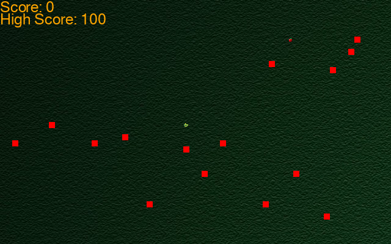

# Snake Game in Python

This repository contains a classic Snake Game implemented in Python using the Pygame library.

## Features

- Full-screen mode
- High score tracking
- Background music and sound effects
- Randomly generated obstacles (bricks)
- Replay functionality

## How to Play

- Use the arrow keys to control the snake's movement.
- Eat the apple to grow the snake and increase your score.
- Avoid colliding with the walls, your own body, and the obstacles.
  
## Installation

1. Clone the repository:
   ```console
   git clone https://github.com/Bornunique911/Snake_Game_in_Python.git
   ```
2. Navigate to the project directory:
   ```console
   cd Snake_Game_in_Python
   ```
3. Install the required dependencies:
   ```console
   pip3 install -r requirements.txt
   ```

## Running the Game

To start the game, run the following command:
```console
python3 snake-game.py
```

## Dependencies

- Python 3.x
- Pygame

## Screenshots



## Acknowledgements

- Background music: [Bensound](https://www.bensound.com)
- Sound effects: [Mixkit](https://mixkit.co)
